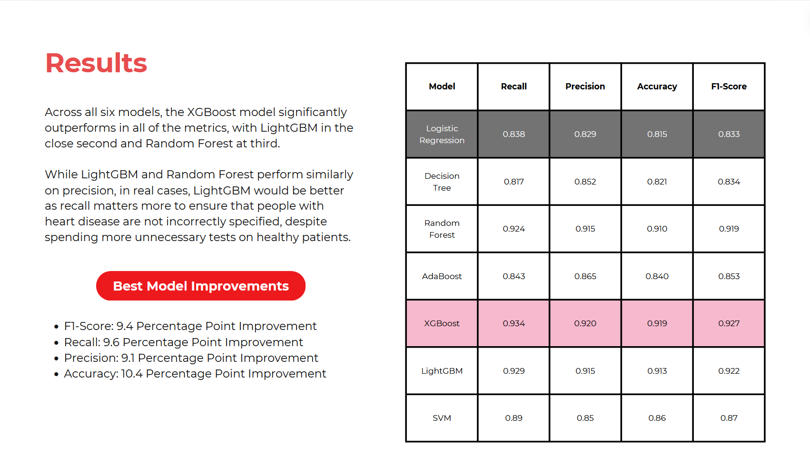

# IndonesiaAI-Portfolio-Project-4
 Heart Disease Prediction using Python and Scikit-Learn

📁 Created by: Mohammad Arief Rajendra, in June 2024

## Project 4: Heart Disease Prediction

The Heart Disease Prediction Project is part of Indonesia AI's Bootcamp Portfolio Project, which tasks students with developing machine learning algorithms to predict heart disease in patients. The dataset itself is a combination from 5 different datasets, including Cleveland, Hungarian, Switzerland, Long Beach VA, and Statlog (Heart) Data Set. It consists of 1,190 observations and 11 features.

To predict the incidence of heart disease in patients, my team utilized seven machine learning algorithms, namely Logistic Regression, Decision Tree, Random Forest, XGBoost, AdaBoost, LightGBM, and SVM. I was tasked with the implementation of all models except the SVM, which will be available in the Jupyter Notebook. 

## Getting Started

You can easily implement the code in this repository by:

1. Cloning this project
2. Set up Python and Jupyter Notebook locally, either directly from Python or using Anaconda, or you can use Google Colab if you wish to have faster processing without a local GPU
3. Make sure that you have installed the required packages that are included at the start of the Jupyter Notebook .ipynb file
4. Run the code as is, or add your modifications

## The Result

Our estimations find that the XGBoost model significantly outperforms all other models, and should be used for further predictions. 

